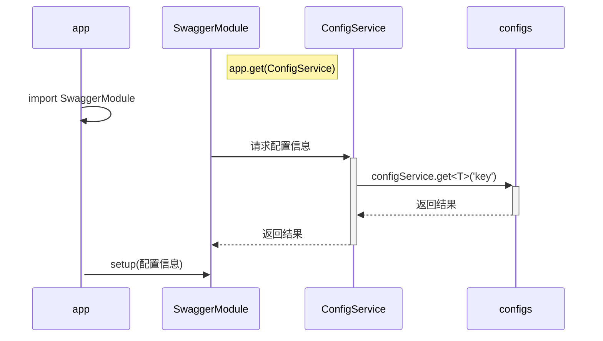
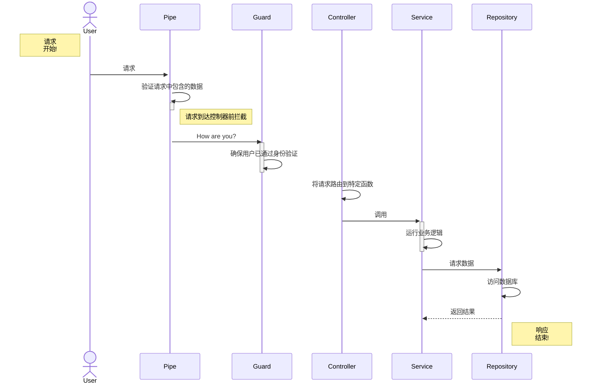

## Nest集成Swagger时序图

```mermaid
sequenceDiagram
    participant app
    participant SwaggerModule
    participant ConfigService
    Note left of ConfigService: app.get(ConfigService)
    participant configs

    app->>+app: import SwaggerModule
    SwaggerModule->>+ConfigService: 请求配置信息
    ConfigService->>+configs: configService.get<T>('key')
    configs-->>-ConfigService: 返回结果
    ConfigService-->>-SwaggerModule: 返回结果
    app->>SwaggerModule: setup(配置信息)

```

## 示例

```mermaid
sequenceDiagram
    actor User
    Note left of User: 请求 <br/>开始!

    User->>+Pipe: 请求
    participant Pipe
    participant Guard
    participant Controller
    participant Service
    participant Repository
    Pipe->>Pipe: 验证请求中包含的数据
    activate Pipe
    deactivate Pipe
    Note right of Pipe: 请求到达控制器前拦截
    Pipe->>Guard: How are you?
    activate Guard
    Guard->>Guard: 确保用户已通过身份验证
    deactivate Guard
    Controller->>Controller: 将请求路由到特定函数
    Controller->>+Service: 调用
    Service->>-Service: 运行业务逻辑
    Service->>Repository: 请求数据
    Repository->>Repository: 访问数据库
    Repository-->>Service: 返回结果
    Note right of Repository: 响应 <br/>结束!

```

